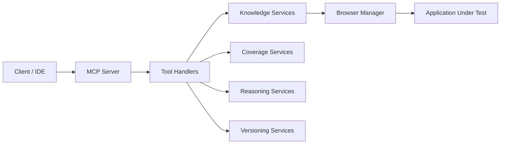

# Architecture

## Overview

QaBrainMCP is a TypeScript-based Model Context Protocol (MCP) server that helps QA teams turn browser interactions, requirement text, and application knowledge into reusable intelligence.

The system combines four core layers:

- Browser layer: launches and drives browser sessions
- Knowledge layer: stores learned application structure and workflows
- Reasoning layer: maps requirements and answers questions using stored knowledge
- MCP layer: exposes capabilities as tools to clients

## Component Interaction

## Key Subsystems

### Knowledge Graph

The knowledge graph captures pages, components, locators, relationships, and workflow context discovered while learning an application. It is used for query, comparison, and impact analysis.

### Requirement Engine

The requirement engine parses Gherkin-style feature text and maps scenarios and steps to known pages, workflows, and locators.

### Coverage Engine

The coverage engine evaluates which parts of a requirement are represented in the learned knowledge base and highlights missing coverage or validation gaps.

### Reasoning Engine

The reasoning engine uses remembered knowledge to infer QA recommendations, risks, and likely missing steps for a requirement.

### Workflow Engine

The workflow engine stores workflows, locators, and actions that can be referenced during learning, analysis, and reporting.

### Application Knowledge

Application knowledge is stored in domain models for pages, components, snapshots, and relationships. This layer is responsible for persistence and retrieval of learned context.

### Browser Layer

The browser layer manages browser sessions and page navigation. It is used by the learning and inspection workflows.

### MCP Layer

The MCP layer registers tools exposed to clients over the Model Context Protocol. Each tool is responsible for a focused capability such as requirement mapping or knowledge graph queries.

## Repository Layout

- src/config: environment and configuration management
- src/mcp: MCP server and tool registration
- src/knowledge: application learning and knowledge services
- src/knowledge-graph: graph building and querying
- src/coverage: coverage analysis services
- src/impact: impact analysis services
- src/reasoning: reasoning and recommendation services
- src/versioning: snapshots and incremental learning
- src/browser: browser lifecycle and navigation
- src/tools: tool entry points for local execution
